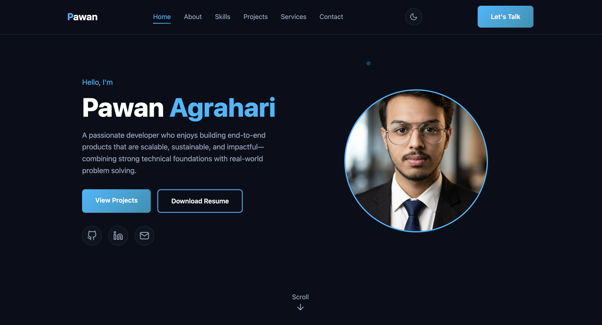

# Personal Portfolio

A modern and responsive developer portfolio website built to showcase my projects, skills, and developer journey.

## 🚀 Features

- Responsive Design
- Dark Theme UI
- Smooth Navigation
- Projects Showcase
- Skills Section
- Contact Section
- Social Links Integration

## 🛠️ Technologies Used

- HTML5
- CSS3
- JavaScript

## 📂 Projects Included

- Spotify Clone
- Loan Eligibility Predictor
- Developer Portfolio

## 📸 Screenshots

### Home Page


## 🔗 Live Demo

https://devbypawan.github.io/personal-portfolio/

## 📁 Folder Structure

```bash
personal-portfolio/
│
├── assets/
├── index.html
├── style.css
├── script.js
└── README.md
```

## 📬 Contact

- GitHub: https://github.com/DevByPawan
- LinkedIn: https://www.linkedin.com/in/pawan-agrahari-13bbb4317/

## ⭐ If you like this project, consider giving it a star!

## 📸 Screenshots

### Home Page

